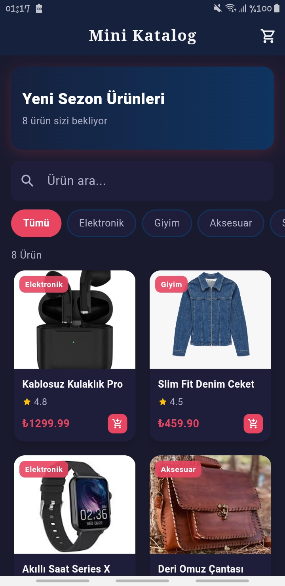
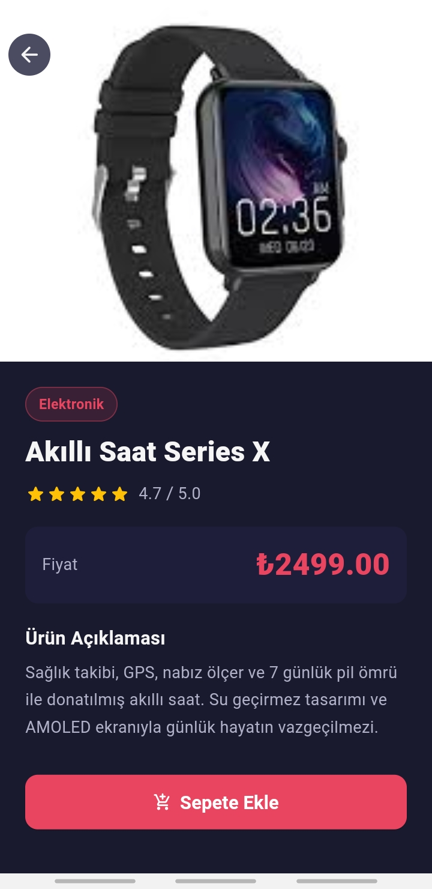
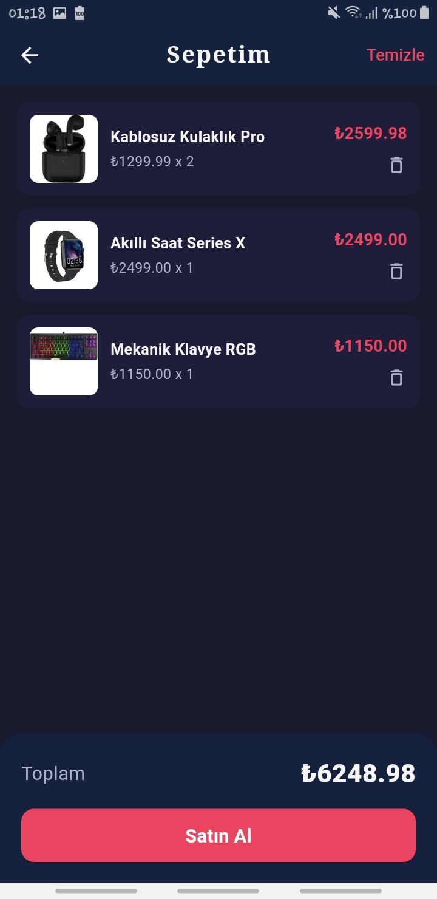
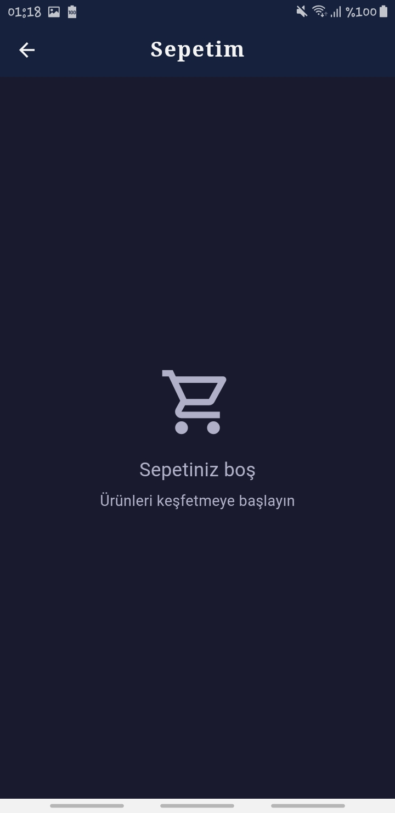

# 🛍️ Mini Katalog — Flutter Eğitim Projesi

> Flutter ile geliştirilmiş profesyonel bir mobil ürün kataloğu uygulaması.

---

<p align="center">
  
  
  
  
</p>

---

## 📱 Proje Hakkında

**Mini Katalog**, Flutter Günlük Eğitimi kapsamında 5 günlük müfredatı tamamlayan öğrenciler tarafından geliştirilen bir mobil alışveriş kataloğu uygulamasıdır. Temel Flutter kavramlarını gerçek bir proje üzerinde pekiştirmek amacıyla tasarlanmıştır.

---

## ✨ Özellikler

| Özellik | Açıklama |
|---|---|
| 🏠 Ana Ekran | Banner, arama ve ürün grid listesi |
| 🔍 Arama | Gerçek zamanlı ürün arama |
| 🏷️ Kategori Filtresi | Kategoriye göre ürün filtreleme |
| 📦 Ürün Detay | Tam ekran ürün bilgisi ve görsel |
| 🛒 Sepet Yönetimi | Ürün ekle, çıkar, toplam hesaplama |
| 🎨 Özel Tema | Dark mode, özel renk paleti |

---

## 🗂️ Proje Klasör Yapısı

```
lib/
├── main.dart                  # Uygulama giriş noktası
├── theme/
│   └── app_theme.dart         # Tema & renk tanımları
├── models/
│   ├── product.dart           # Ürün veri modeli (fromJson/toJson)
│   ├── cart.dart              # Sepet modeli & CartItem
│   └── product_service.dart   # Ürün veri servisi
├── screens/
│   ├── home_screen.dart       # Ana sayfa (GridView + Arama)
│   ├── product_detail_screen.dart  # Ürün detay sayfası
│   └── cart_screen.dart       # Sepet sayfası
└── widgets/
    ├── product_card.dart      # Tekrar kullanılabilir ürün kartı
    └── category_filter.dart   # Yatay kaydırmalı kategori filtresi

assets/
├── screenshot/                # Uygulama ekran görselleri
└── data/
    └── products.json          # Örnek ürün verisi (JSON)
```

---

## 🛠️ Kullanılan Teknolojiler

- **Flutter SDK** — `>=3.0.0`
- **Dart SDK** — `>=3.0.0 <4.0.0`
- **material.dart** — Varsayılan Flutter UI kütüphanesi

> ℹ️ Ekstra paket kullanılmamıştır. Proje tamamen Flutter'ın yerleşik widget'ları ile geliştirilmiştir.

---

## 🚀 Çalıştırma Adımları

### Gereksinimler

- [Flutter SDK](https://docs.flutter.dev/get-started/install) kurulu olmalıdır
- Android emülatör veya fiziksel cihaz hazır olmalıdır

### Kurulum

```bash
# 1. Depoyu klonlayın
git clone https://github.com/zuleyha04/mini_katalog.git
cd mini_katalog

# 2. Bağımlılıkları yükleyin
flutter pub get

# 3. Uygulamayı başlatın
flutter run
```

### Flutter Sürümü Kontrolü

```bash
flutter --version
```

---

## 📚 Öğrenilen Kavramlar

Bu proje aşağıdaki Flutter/Dart konularını kapsamaktadır:

- ✅ **StatelessWidget & StatefulWidget** — Widget tipleri ve state yönetimi
- ✅ **Navigator.push / pop** — Sayfa geçişleri
- ✅ **Route Arguments** — Sayfalar arası veri taşıma
- ✅ **GridView.builder** — Dinamik grid listeleme
- ✅ **ListView.builder** — Dinamik liste oluşturma
- ✅ **fromJson / toJson** — JSON veri modelleme
- ✅ **CustomScrollView & SliverAppBar** — Gelişmiş scroll davranışı
- ✅ **ThemeData** — Uygulama geneli tema
- ✅ **SnackBar & AlertDialog** — Kullanıcı bildirimleri
- ✅ **Image.network** — Ağdan görsel yükleme

---